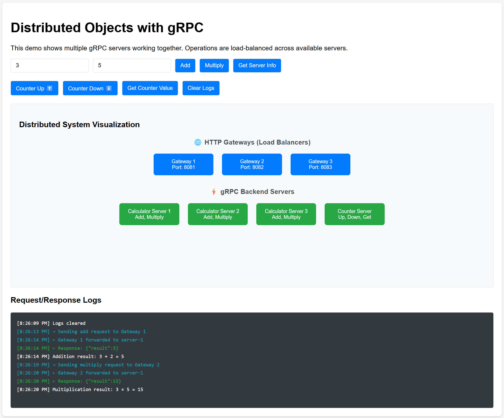

# Distributed Objects with gRPC - Educational Demo

A comprehensive educational example demonstrating distributed object concepts using gRPC, designed to help students understand how distributed systems work in practice.

## 🎯 Learning Objectives

This project teaches key distributed systems concepts:

### **Distributed Objects**
- Multiple server instances providing the same service interface
- Objects (services) running on different machines/containers
- Client transparency - doesn't need to know which server handles requests

### **Load Balancing & Service Discovery**
- Round-robin distribution of requests across multiple servers
- Gateway pattern for service routing and load balancing
- Fault tolerance through redundancy

### **Protocol Translation**
- HTTP to gRPC translation layer
- Multiple protocol support (REST API + gRPC)
- Gateway as protocol adapter

### **Stateful vs Stateless Services**
- **Calculator servers**: Stateless (can handle any request)
- **Counter server**: Stateful (maintains persistent state)
- Data persistence with file storage and Docker volumes

### **Microservices Architecture**
- Service separation by responsibility
- Independent scaling and deployment
- Network communication between services

## 🏗️ Architecture

```
┌─────────────┐
│   Browser   │ (HTTP Client)
└─────┬───────┘
      │ HTTP/HTTPS
      ▼
┌─────────────┐     ┌─────────────┐     ┌─────────────┐
│  Gateway 1  │     │  Gateway 2  │     │  Gateway 3  │
│   :8081     │     │   :8082     │     │   :8083     │
└─────┬───────┘     └─────┬───────┘     └─────┬───────┘
      │ gRPC              │ gRPC              │ gRPC
      ▼                   ▼                   ▼
┌─────────────┬─────────────┬─────────────┬─────────────┐
│Calculator 1 │Calculator 2 │Calculator 3 │Counter Srv  │
│   :50051    │   :50051    │   :50051    │   :50054    │
│  (Add/Mult) │  (Add/Mult) │  (Add/Mult) │(Up/Down/Get)│
└─────────────┴─────────────┴─────────────┴─────────────┘
```

## 🧪 What You'll Learn by Testing

### **1. Load Balancing in Action**
- Click "Add" or "Multiply" multiple times
- Watch requests rotate between Calculator servers (server-1, server-2, server-3)
- Observe even distribution of load

### **2. Service Specialization**
- Calculator operations: Distributed across multiple stateless servers
- Counter operations: Always routed to the single stateful counter server
- Different routing strategies for different service types

### **3. State Persistence**
- Counter value persists across container restarts
- Demonstrates stateful service patterns
- Shows data durability in distributed systems

### **4. Real-time Visualization**
- Gateway highlighting: Shows which gateway receives requests
- Server highlighting: Shows which backend processes requests
- Connection lines: Visualizes request flow through the system
- Logs: Detailed request/response tracking

### **5. Fault Tolerance**
- Multiple gateways provide redundancy
- Multiple calculator servers ensure availability
- System continues working even if individual components fail

## 📸 Demo Screenshots & Video

### **System Interface**


*The interactive web interface showing the complete distributed system visualization with gateways, backend servers, and real-time request logs.*

### **Live Demo Video**
[](media-doc/demo-optimized.mp4)

*Click to watch a demonstration of the system in action, showing load balancing, server intercommunication, and real-time visualization.*

## 🚀 Quick Start

### **Local Development**
```bash
docker-compose up --build
```
Open: http://localhost:8080

### **GitHub Codespaces**
```bash
docker-compose up --build
```
The client auto-detects Codespaces and uses proper port forwarding.

## 🧑‍💻 Interactive Learning Experience

### **Try These Experiments:**

1. **Load Balancing Test**
   - Click "Add" 10 times rapidly
   - Notice how requests distribute across servers
   - Check logs to see the pattern

2. **Counter Persistence Test**
   - Click "Counter Up" several times
   - Restart containers: `docker-compose restart`
   - Click "Get Counter Value" - value should persist

3. **Service Routing Test**
   - Try calculator operations (Add/Multiply)
   - Try counter operations (Up/Down)
   - Notice different servers handle different operations

4. **Visualization Learning**
   - Watch the real-time highlighting
   - Follow connection lines from gateway to server
   - Understand the request flow

## 📂 Project Structure

```
├── calculator.proto          # gRPC service definitions
├── server.py                 # Calculator server implementation
├── counter_server.py         # Counter server with persistence
├── gateway.py                # HTTP-to-gRPC gateway
├── client/index.html         # Interactive web client
├── docker-compose.yml        # Multi-container setup
├── Dockerfile               # Calculator server image
├── Dockerfile.counter       # Counter server image
└── Dockerfile.gateway       # Gateway image
```

## 🔧 Key Components

### **Services**
- **3x Calculator Servers**: Stateless math operations (Add, Multiply)
- **1x Counter Server**: Stateful counter with file persistence
- **3x HTTP Gateways**: Protocol translation and load balancing
- **1x Web Client**: Interactive visualization and testing

### **Technologies**
- **gRPC**: High-performance RPC framework
- **Protocol Buffers**: Service interface definitions
- **Flask**: HTTP gateway implementation
- **Docker**: Containerization and orchestration
- **JavaScript**: Interactive client with real-time visualization

## 🎓 Educational Value

This project demonstrates real-world distributed systems concepts in a simplified, visual way:

- **Practical Experience**: Hands-on interaction with distributed services
- **Visual Learning**: Real-time system behavior visualization
- **Conceptual Understanding**: Load balancing, state management, service routing
- **Industry Relevance**: Technologies and patterns used in production systems

Perfect for computer science students learning distributed systems, microservices, or cloud computing concepts.

---

## 🇪🇸 Descripción en Español

# Objetos Distribuidos con gRPC - Demo Educativo

Un ejemplo educativo integral que demuestra conceptos de objetos distribuidos usando gRPC, diseñado para ayudar a estudiantes a entender cómo funcionan los sistemas distribuidos en la práctica.

## 🎯 Objetivos de Aprendizaje

Este proyecto enseña conceptos clave de sistemas distribuidos:

### **Objetos Distribuidos**
- Múltiples instancias de servidor proporcionando la misma interfaz de servicio
- Objetos (servicios) ejecutándose en diferentes máquinas/contenedores
- Transparencia del cliente - no necesita saber qué servidor maneja las solicitudes

### **Balanceador de Carga y Descubrimiento de Servicios**
- Distribución round-robin de solicitudes entre múltiples servidores
- Patrón gateway para enrutamiento de servicios y balanceo de carga
- Tolerancia a fallos a través de redundancia

### **Traducción de Protocolos**
- Capa de traducción de HTTP a gRPC
- Soporte para múltiples protocolos (REST API + gRPC)
- Gateway como adaptador de protocolos

### **Servicios Con Estado vs Sin Estado**
- **Servidores calculadora**: Sin estado (pueden manejar cualquier solicitud)
- **Servidor contador**: Con estado (mantiene estado persistente)
- Persistencia de datos con almacenamiento en archivos y volúmenes Docker

### **Arquitectura de Microservicios**
- Separación de servicios por responsabilidad
- Escalado y despliegue independientes
- Comunicación de red entre servicios

## 🧪 Lo Que Aprenderás Probando

### **1. Balanceador de Carga en Acción**
- Haz clic en "Add" o "Multiply" múltiples veces
- Observa cómo las solicitudes rotan entre servidores Calculator (server-1, server-2, server-3)
- Observa la distribución uniforme de la carga

### **2. Especialización de Servicios**
- Operaciones de calculadora: Distribuidas entre múltiples servidores sin estado
- Operaciones de contador: Siempre enrutadas al único servidor contador con estado
- Diferentes estrategias de enrutamiento para diferentes tipos de servicios

### **3. Persistencia de Estado**
- El valor del contador persiste entre reinicios de contenedores
- Demuestra patrones de servicios con estado
- Muestra durabilidad de datos en sistemas distribuidos

### **4. Visualización en Tiempo Real**
- Resaltado de gateway: Muestra qué gateway recibe solicitudes
- Resaltado de servidor: Muestra qué backend procesa solicitudes
- Líneas de conexión: Visualiza el flujo de solicitudes a través del sistema
- Logs: Seguimiento detallado de solicitudes/respuestas

### **5. Tolerancia a Fallos**
- Múltiples gateways proporcionan redundancia
- Múltiples servidores calculadora aseguran disponibilidad
- El sistema continúa funcionando incluso si componentes individuales fallan

## 🎓 Valor Educativo

Este proyecto demuestra conceptos de sistemas distribuidos del mundo real de manera simplificada y visual:

- **Experiencia Práctica**: Interacción práctica con servicios distribuidos
- **Aprendizaje Visual**: Visualización del comportamiento del sistema en tiempo real
- **Comprensión Conceptual**: Balanceador de carga, gestión de estado, enrutamiento de servicios
- **Relevancia Industrial**: Tecnologías y patrones usados en sistemas de producción

Perfecto para estudiantes de ciencias de la computación que aprenden sistemas distribuidos, microservicios o conceptos de computación en la nube.